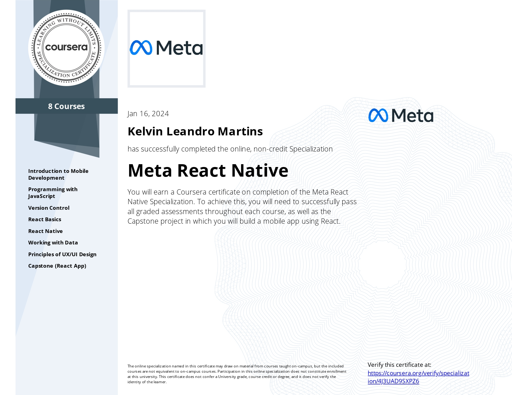

# About this repository
Solved programming exercises from **"Meta React Native"** specialization, available on *Coursera*, offered by *Meta*. 

# About the specialization
The specialization is divided into 8 courses, each one having its own certificate. The courses:

1. Intro to mobile development

2. [Programming with JavaScript](https://github.com/kelvinleandro/coursera-meta-front-end/tree/main/course%2002%20-%20programming%20with%20javascript)

3. Version Control

4. [React Basics](https://github.com/kelvinleandro/coursera-meta-front-end/tree/main/course%2005%20-%20react%20basics)

5. [React Native](https://github.com/kelvinleandro/coursera-meta-react-native/tree/main/course-05-react-native)

6. [Working with data](https://github.com/kelvinleandro/coursera-meta-react-native/tree/main/course-06-working-with-data)

7. [Principles of UX/UI Design](https://github.com/kelvinleandro/coursera-meta-front-end/tree/main/course%2007%20-%20principles%20of%20UX%20UI%20Design)

8. [Capstone React App](https://github.com/kelvinleandro/coursera-meta-react-native/tree/main/course-08-capstone-react-app)

---

